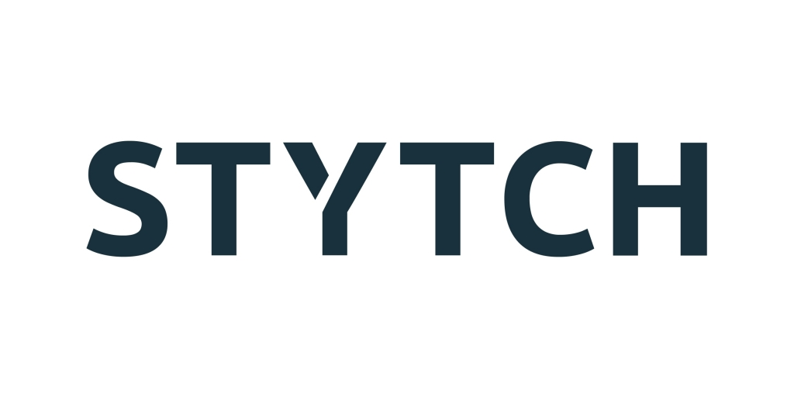
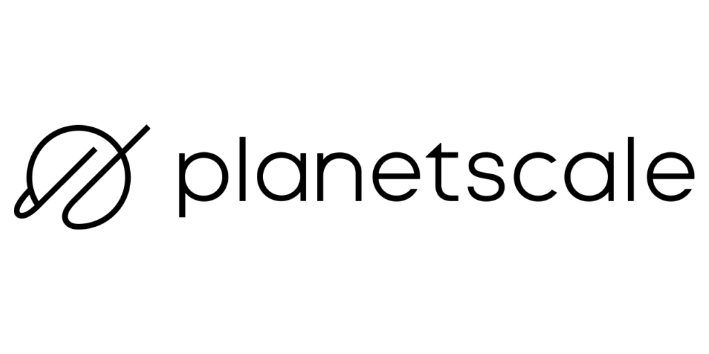

# Stytch + Planetscale Example App

This is a [Stytch](https://stytch.com) + [Planetscale](https://planetscale.com/) project bootstrapped with [`create-next-app`](https://github.com/vercel/next.js/tree/canary/packages/create-next-app).

<<<<<<< HEAD
Stytch
---
> Onboard, authenticate, and engage your users with Stytch’s APIs. Improve security and user experience with flexible, passwordless authentication solutions.

Planetscale
---
> PlanetScale is the only serverless database platform you can start in seconds and scale indefinitely.

This example app was created to demonstrate a lightweight fullstack app using Planetscale's serverless mysql database and Stytch's authentication + session management APIs.

# Getting Started
=======
This example app was created to demonstrate a lightweight fullstack app using Planetscale's serverless mysql database and Stytch's authentication + session management APIs.

Stytch
---


> Onboard, authenticate, and engage your users with Stytch’s APIs. Improve security and user experience with flexible, passwordless authentication solutions.

Planetscale
---


> PlanetScale is the only serverless database platform you can start in seconds and scale indefinitely.


# Getting Started
---
## Setting up Stytch
>>>>>>> f26775ecdb0944c60342095b6a9baa2125bb06eb

## Setting up Stytch
---
After signing up for Stytch, you'll need your project's ID, secret, and public token. You can find these in the [API keys tab](https://stytch.com/dashboard/api-keys).

Once you've gathered these values, add them to a new .env.local file.
Example:

```bash
cp .env.template .env.local
# Replace your keys in new .env.local file
```

Next, add `http://localhost:3000/api/authenticate_magic_link` as a login and signup magic link URL to the dashboard. Stytch, for security purposes, verifies your magic link URLs before they are sent. You can set these magic link URLs for your project in the [Magic link URLs tab](https://stytch.com/dashboard/magic-link-urls).

## Setting up Planetscale
<<<<<<< HEAD
---
=======
>>>>>>> f26775ecdb0944c60342095b6a9baa2125bb06eb

###  Setup database
- Install [Planetscale CLI](https://docs.planetscale.com/reference/planetscale-environment-setup) and authenticate the CLI
```sh
pscale auth login
```
- Create a new database
```sh
pscale database create <database>
```

- Retreive the following credentials from the planetscale dashboard and update your `.env.local` with the credentials
```bash
PLANETSCALE_TOKEN # The service token which you create in the organization settings page
PLANETSCALE_TOKEN_NAME # The id for the token
PLANETSCALE_ORG # The name of your organization (user)
PLANETSCALE_DB # The name of the database you would like to use
```

- Create a `development` branch
```sh
pscale branch create <database> <branch>
```
- Connect to your branch
```sh
# This opens the planetscale mysql shell
pscale shell <database> <branch> 
```
- Create the user table
```sql
CREATE TABLE users (
  id int NOT NULL AUTO_INCREMENT PRIMARY KEY,
  name varchar(255),
  email varchar(255) NOT NULL
);
```
- Create a **deploy request** 
```bash
# This is synonymous with opening a pull request
pscale deploy-request create <database> <branch> 
```
- Find the `<deploy-request-number>`
```bash
pscale deploy-request list <database>
```
- _Deploy_ the **deploy request** 
```bash
pscale deploy-request deploy <database> <deploy-request-number>
```
- Merge your `development` branch into `main`
```bash
pscale deploy-request deploy <database> <deploy-request-number>
```

## Running the example app
---
Install dependencies by running

```bash
npm install
# or
yarn install
```

You can run a development server using:

```bash
npm run dev
# or
yarn dev
```

Open [http://localhost:3000](http://localhost:3000) with your browser to see the result.

### Documentation

Learn more about some of Stytch and Planetscale products used in this example app:

- [Stytch React](https://www.npmjs.com/package/@stytch/stytch-react)
- [Stytch's node client library](https://www.npmjs.com/package/stytch)
- [Stytch Sessions](https://stytch.com/docs/sessions/using-sessions)
- [Planetscale CLI](https://planetscale.com/cli)
